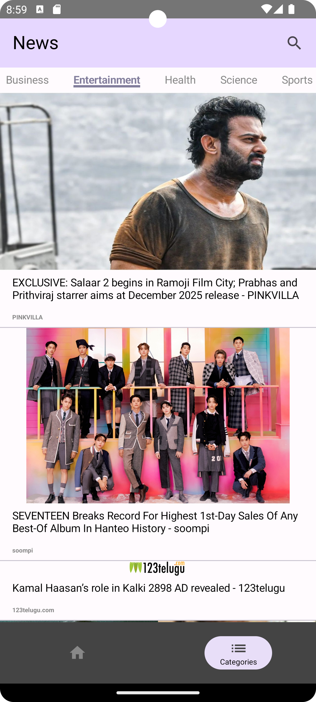
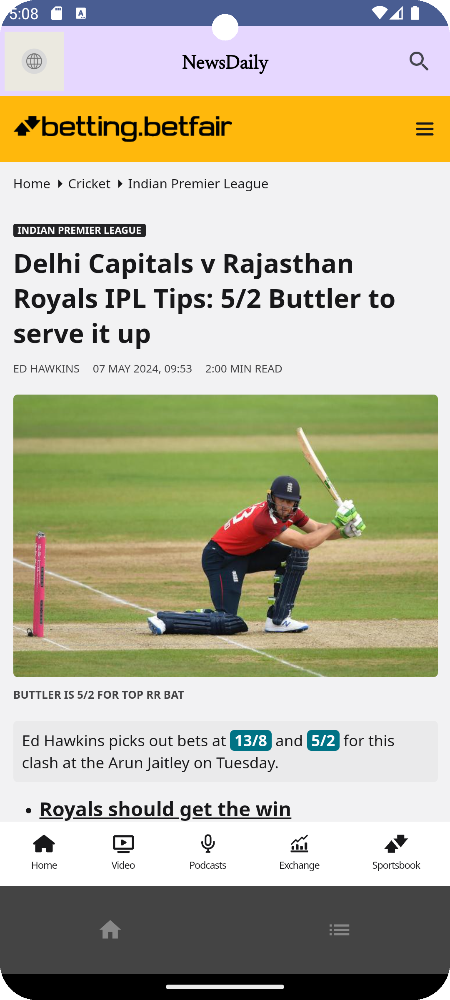

# NewsDaily

## Overview
The NewsDaily is a simple Android application built using Kotlin, Jetpack Compose, and Retrofit. It allows users to browse the latest news articles from various categories such as business, general, entertainment, health, science, and sports.

## Technologies Used
- **Kotlin**: The app is built using the Kotlin programming language.
- **Jetpack Compose**:  UI components are built using Jetpack Compose, the modern toolkit for building native Android UI.
- **Android Architecture Components**: ViewModel, LiveData, and Navigation components are used for managing UI-related data and navigation.
- **Retrofit**: Network requests are made using Retrofit library for fetching news data from remote APIs.
- **Picasso**: Images are loaded and displayed using the Picasso image loading library.
- **LiveData**: Part of Android Jetpack, LiveData is an observable data holder that is lifecycle-aware, meaning it respects the lifecycle of other app components.
- **ViewModel**: Another component of Android Jetpack, ViewModel is designed to store and manage UI-related data in a lifecycle-conscious way.

## Usage
- Upon launching the app, users are presented with a list of news articles from the "General" category.
- Clicking on a news article opens a detailed view where users can read the full article or navigate to the original source.
- Users can navigate to different categories using the bottom navigation bar.
- Categories: Explore news articles categorized into different topics such as Business, Entertainment, Health, Science, Sports, etc.
- Search: Search for specific news articles by entering keywords.
- Pull-to-refresh: Pull down to refresh the news feed and fetch the latest articles.

## Screenshots
   

